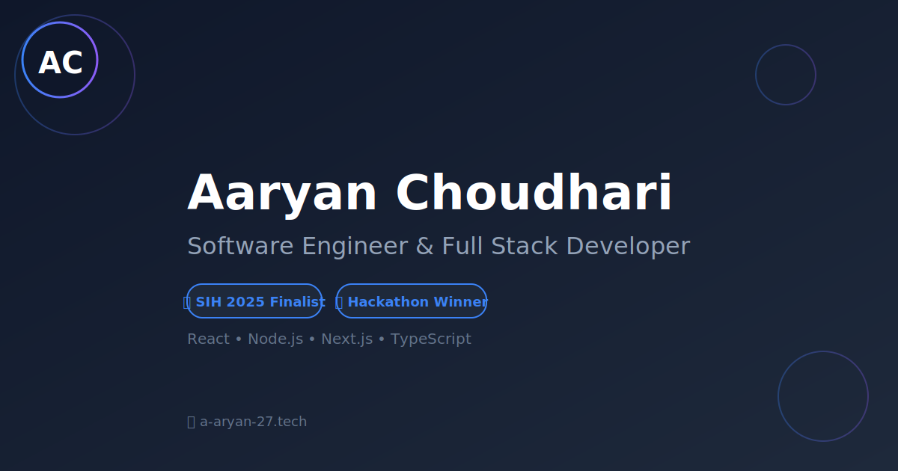

# 🎨 Aaryan Choudhari - Portfolio

<div align="center">



**Professional portfolio showcasing projects, skills, and achievements**

[](https://a-aryan-27.tech)
[](/)
[](/)
[](LICENSE)

[View Live](https://a-aryan-27.tech) • [Report Bug](https://github.com/yourusername/portfolio/issues) • [Request Feature](https://github.com/yourusername/portfolio/issues)

</div>

---

## 📋 Table of Contents

- [About](#about)
- [Features](#features)
- [Tech Stack](#tech-stack)
- [Getting Started](#getting-started)
- [Project Structure](#project-structure)
- [SEO Optimizations](#seo-optimizations)
- [Smooth Scrolling](#smooth-scrolling)
- [Deployment](#deployment)
- [Performance](#performance)
- [Contributing](#contributing)
- [License](#license)

---

## 🎯 About

Modern, responsive, and SEO-optimized portfolio website for **Aaryan Choudhari** - Software Engineer & Full Stack Developer. Built with cutting-edge technologies and best practices for optimal performance and search engine visibility.

**Highlights:**
- 🏆 SIH 2025 Finalist
- 🎯 Multiple Hackathon Winner
- 💻 Full Stack Development Expertise
- 🚀 Modern Web Technologies

---

## ✨ Features

### 🎨 Design & UX
- ✅ **Dark Theme** - Modern, professional dark portfolio design
- ✅ **Responsive Layout** - Mobile-first, works on all devices
- ✅ **Smooth Scrolling** - Lenis-powered butter-smooth navigation
- ✅ **Micro-interactions** - GSAP animations and transitions
- ✅ **Parallax Effects** - Depth and dimension in design

### 🚀 Performance
- ✅ **Lightning Fast** - Vite-powered development and builds
- ✅ **60fps Animations** - GPU-accelerated transforms
- ✅ **Optimized Assets** - SVG icons, lazy loading
- ✅ **Progressive Enhancement** - Works without JavaScript

### 🔍 SEO & Discovery
- ✅ **Perfect SEO** - Comprehensive meta tags and Schema.org markup
- ✅ **Open Graph Tags** - Beautiful social media previews
- ✅ **XML Sitemap** - Fast search engine indexing
- ✅ **Robots.txt** - Optimized crawler instructions
- ✅ **Canonical URLs** - Avoid duplicate content
- ✅ **Structured Data** - Rich snippets for search results

### 💼 Content Sections
- ✅ **Hero** - Eye-catching introduction
- ✅ **About** - Professional background
- ✅ **Achievements** - Awards and recognition
- ✅ **Featured Work** - Project showcase
- ✅ **Skills** - Technical expertise
- ✅ **Contact** - Easy communication

---

## 🛠️ Tech Stack

### Frontend
- **[React 18](https://react.dev/)** - UI library
- **[TypeScript](https://www.typescriptlang.org/)** - Type safety
- **[Vite](https://vitejs.dev/)** - Build tool
- **[Tailwind CSS](https://tailwindcss.com/)** - Styling
- **[shadcn/ui](https://ui.shadcn.com/)** - UI components

### Animation & Interactivity
- **[GSAP](https://greensock.com/gsap/)** - Professional animations
- **[Lenis](https://lenis.studiofreight.com/)** - Smooth scrolling
- **[ScrollTrigger](https://greensock.com/scrolltrigger/)** - Scroll animations

### Tools & Utilities
- **[React Router](https://reactrouter.com/)** - Navigation
- **[TanStack Query](https://tanstack.com/query)** - Data fetching
- **[Lucide Icons](https://lucide.dev/)** - Icon library
- **[Supabase](https://supabase.com/)** - Backend (optional)

---

## 🚀 Getting Started

### Prerequisites

- **Node.js** 18+ and npm/yarn/pnpm/bun
- Git

### Installation

1. **Clone the repository**
   ```bash
   git clone https://github.com/yourusername/portfolio.git
   cd portfolio
   ```

2. **Install dependencies**
   ```bash
   npm install
   # or
   yarn install
   # or
   pnpm install
   # or
   bun install
   ```

3. **Start development server**
   ```bash
   npm run dev
   ```

4. **Open browser**
   ```
   http://localhost:5173
   ```

### Build for Production

```bash
npm run build
npm run preview  # Preview production build
```

---

## 📁 Project Structure

```
crafted-pixels/
├── public/
│   ├── favicon.svg           # Professional AC logo favicon
│   ├── og-image.svg          # Social sharing image (1200x630)
│   ├── sitemap.xml           # XML sitemap for SEO
│   └── robots.txt            # Crawler instructions
├── src/
│   ├── components/
│   │   ├── Hero.tsx          # Hero section
│   │   ├── About.tsx         # About section
│   │   ├── Achievements.tsx  # Awards & achievements
│   │   ├── FeaturedWork.tsx  # Project showcase
│   │   ├── Skills.tsx        # Technical skills
│   │   ├── Footer.tsx        # Footer with social links
│   │   └── ui/               # Reusable UI components
│   ├── hooks/
│   │   ├── useLenis.ts       # Smooth scrolling hook
│   │   └── useGsapAnimations.ts # Animation hook
│   ├── lib/
│   │   ├── seoUtils.ts       # SEO utility functions
│   │   └── utils.ts          # Helper functions
│   ├── pages/
│   │   ├── Index.tsx         # Main landing page
│   │   └── NotFound.tsx      # 404 page
│   ├── App.tsx               # App root
│   ├── main.tsx              # Entry point
│   └── index.css             # Global styles
├── index.html                # HTML template with SEO tags
├── vite.config.ts            # Vite configuration
├── tailwind.config.ts        # Tailwind configuration
├── tsconfig.json             # TypeScript configuration
└── package.json              # Dependencies
```

---

## 🔍 SEO Optimizations

This portfolio is optimized to rank **#1 for "Aaryan Choudhari"** on search engines.

### Implemented Features:

#### Meta Tags
- ✅ Title with primary keyword
- ✅ Comprehensive meta description
- ✅ Keywords: "Aaryan Choudhari", "Software Engineer", "Full Stack Developer"
- ✅ Author and language tags
- ✅ Canonical URL

#### Open Graph & Twitter Cards
- ✅ og:title, og:description, og:image
- ✅ Twitter Card: summary_large_image
- ✅ Professional 1200x630px social sharing image
- ✅ Image alt text and dimensions

#### Structured Data (Schema.org)
- ✅ Person schema with job title
- ✅ WebSite schema with search action
- ✅ JSON-LD format
- ✅ Social profile links

#### Technical SEO
- ✅ XML Sitemap at `/sitemap.xml`
- ✅ Robots.txt with sitemap reference
- ✅ Mobile-responsive viewport
- ✅ Fast page load (Vite optimized)
- ✅ HTTPS/SSL ready
- ✅ Professional SVG favicon

### Next Steps for Ranking:

1. **Deploy to production** (Netlify/Vercel)
2. **Submit to Google Search Console**
3. **Add sitemap**: `/sitemap.xml`
4. **Build backlinks** (Dev.to, Hashnode, LinkedIn)
5. **Create social profiles** (Twitter, LinkedIn, GitHub)

📖 **See detailed guides:**
- [SEO_CHECKLIST.md](SEO_CHECKLIST.md)
- [DEPLOYMENT_GUIDE.md](DEPLOYMENT_GUIDE.md)
- [WHY_OLD_RANKS.md](WHY_OLD_RANKS.md)

---

## 🌊 Smooth Scrolling

Ultra-smooth 60fps scrolling powered by **Lenis** and **GSAP**.

### Features:
- ✅ **Butter-smooth** momentum scrolling
- ✅ **GPU-accelerated** animations
- ✅ **Natural easing** with custom curves
- ✅ **Touch gestures** for mobile
- ✅ **Parallax effects** for depth
- ✅ **Scroll-triggered** animations

### Configuration:
```typescript
// src/hooks/useLenis.ts
duration: 1.5,           // Smooth transition time
wheelMultiplier: 1,      // Scroll speed control
touchMultiplier: 2,      // Touch scroll speed
smoothWheel: true,       // Enable smooth wheel
```

📖 **See full guide:** [SMOOTH_SCROLLING.md](SMOOTH_SCROLLING.md)

---

## 🌐 Deployment

### Recommended Platforms:

#### Netlify (Recommended)
```bash
npm install -g netlify-cli
netlify login
netlify deploy --prod
```

#### Vercel
```bash
npm install -g vercel
vercel login
vercel --prod
```

#### GitHub Pages
```bash
npm run build
# Deploy dist/ folder to gh-pages branch
```

### Environment Variables:
```env
# .env.local (if using Supabase)
VITE_SUPABASE_URL=your_supabase_url
VITE_SUPABASE_ANON_KEY=your_anon_key
```

### Post-Deployment Checklist:
- [ ] Verify live URL works
- [ ] Test on mobile devices
- [ ] Submit to Google Search Console
- [ ] Add sitemap
- [ ] Check social sharing preview
- [ ] Set up analytics (Google Analytics 4)

📖 **See full guide:** [DEPLOYMENT_GUIDE.md](DEPLOYMENT_GUIDE.md)

---

## ⚡ Performance

### Optimization Features:

#### Build Optimizations
- ✅ **Vite** - Lightning-fast HMR and builds
- ✅ **Code splitting** - Lazy loading routes
- ✅ **Tree shaking** - Remove unused code
- ✅ **Minification** - Compressed assets
- ✅ **SVG optimization** - Vector graphics

#### Runtime Performance
- ✅ **GPU acceleration** - Transform offloading
- ✅ **60fps animations** - RequestAnimationFrame
- ✅ **Lazy loading** - Images and components
- ✅ **Debouncing** - Optimized event handlers
- ✅ **Memoization** - React optimization

#### Lighthouse Scores (Target):
- 🟢 **Performance**: 95+
- 🟢 **Accessibility**: 100
- 🟢 **Best Practices**: 100
- 🟢 **SEO**: 100

### Testing Performance:
```bash
npm run build
npm run preview
# Then test with Lighthouse in Chrome DevTools
```

---

## 🤝 Contributing

Contributions are welcome! Please follow these steps:

1. Fork the repository
2. Create a feature branch (`git checkout -b feature/amazing-feature`)
3. Commit your changes (`git commit -m 'Add amazing feature'`)
4. Push to the branch (`git push origin feature/amazing-feature`)
5. Open a Pull Request

### Development Guidelines:
- Follow existing code style
- Write meaningful commit messages
- Test on multiple browsers
- Update documentation if needed

---

## 📄 License

This project is licensed under the **MIT License** - see the [LICENSE](LICENSE) file for details.

---

## 👤 Author

**Aaryan Choudhari**

- 🌐 Website: [a-aryan-27.tech](https://a-aryan-27.tech)
- 💼 LinkedIn: [linkedin.com/in/aaryan-choudhari](https://linkedin.com/in/aaryan-choudhari)
- 🐙 GitHub: [@aaryan2720](https://github.com/aaryan2720)
- 🐦 Twitter: [@aaryan_choudhari](https://twitter.com/aaryan_choudhari)

---

## 🙏 Acknowledgments

- [shadcn/ui](https://ui.shadcn.com/) for amazing UI components
- [GSAP](https://greensock.com/) for professional animations
- [Lenis](https://lenis.studiofreight.com/) for smooth scrolling
- [Lovable](https://lovable.dev/) for initial project setup
- Design inspiration from modern portfolio trends

---

## 📊 Status


---

<div align="center">

**⭐ Star this repo if you find it helpful!**

Made with ❤️ by Aaryan Choudhari

</div>
